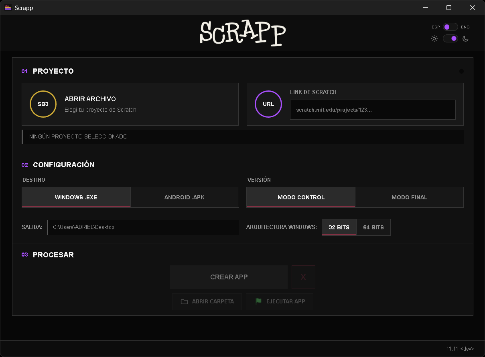

# Scrapp

**Español** | [English](README.en.md)

Scrapp convierte proyectos de Scratch en aplicaciones independientes para Windows y Android mediante una interfaz sencilla orientada al uso educativo.

> Scrapp es un proyecto independiente. No está afiliado, patrocinado ni aprobado por Scratch Foundation ni por TurboWarp.



## Características

- Importación de archivos `.sb3` y proyectos públicos mediante URL.
- Exportación a un único archivo `.exe` para Windows.
- Exportación a `.apk` para Android.
- Modo Control con ejecución, pausa, detención, volumen, mute y turbo.
- Modo Final con inicio automático y control de volumen.
- Aplicaciones Windows de 32 y 64 bits.
- Ventanas redimensionables que mantienen la proporción del proyecto.
- Interfaz en español e inglés.
- Temas claro y oscuro.

## Descarga

La versión compilada se distribuye desde la sección [Releases](https://github.com/adrionbass/Scrapp/releases). El ejecutable no se almacena dentro del repositorio porque supera el límite habitual de tamaño de GitHub.

## Requisitos

### Uso general

- Windows 10 u 11.
- Conexión a Internet para importar proyectos mediante URL y descargar componentes que todavía no estén en caché.

### Exportación a Android

- JDK compatible.
- Android SDK.
- Android Build Tools 35.0.0 o posterior.
- Android 6.0 / API 23 o posterior en el dispositivo de destino.

## Uso

1. Abrí un archivo `.sb3` o pegá la URL de un proyecto público.
2. Elegí Windows o Android.
3. Seleccioná Modo Control o Modo Final.
4. Indicá la arquitectura cuando el destino sea Windows.
5. Presioná **Crear app**.

Por defecto, los archivos resultantes se guardan en el Escritorio. La ubicación puede cambiarse desde el campo **Salida**.

## Desarrollo

Se requiere Node.js 20 o posterior.

```powershell
npm install
npm test
npm run build:exporter
```

El ejecutable de Scrapp se genera en `outputs/Scrapp.exe`.

La información técnica adicional se encuentra en:

- [Compilación](BUILDING.md)
- [Compatibilidad](COMPATIBILITY.md)
- [Arquitectura](docs/ARCHITECTURE.md)
- [Componentes de terceros](THIRD_PARTY_NOTICES.md)

## Responsabilidad sobre los proyectos

Cada usuario es responsable de contar con autorización para utilizar y distribuir los scripts, imágenes, sonidos, extensiones y demás contenidos incluidos en los proyectos que convierta con Scrapp.

## Licencia

El código original, la identidad visual y los binarios oficiales de Scrapp están protegidos por la [licencia propietaria de Scrapp](LICENSE.md). Se permite utilizar los binarios oficiales con fines personales y educativos, pero no redistribuirlos, modificarlos ni venderlos sin autorización escrita.

Los componentes de terceros conservan sus propias licencias, detalladas en [THIRD_PARTY_NOTICES.md](THIRD_PARTY_NOTICES.md).

## Autor

**Adriel Miño**  
11:11 &lt;dev&gt;

- [GitHub](https://github.com/adrionbass)
- [LinkedIn](https://www.linkedin.com/in/adrielyosoy/)
